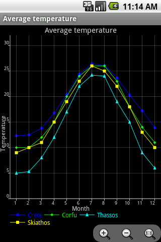
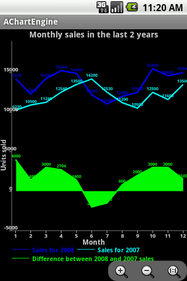
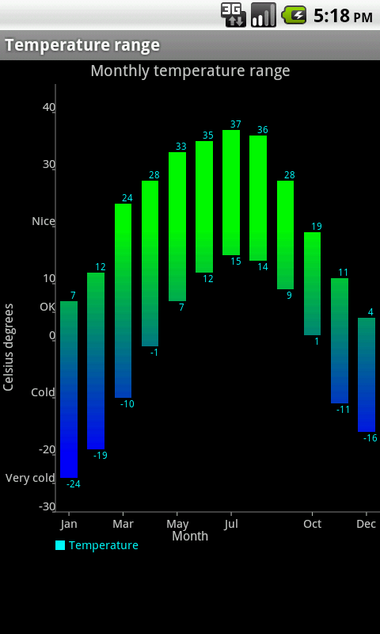
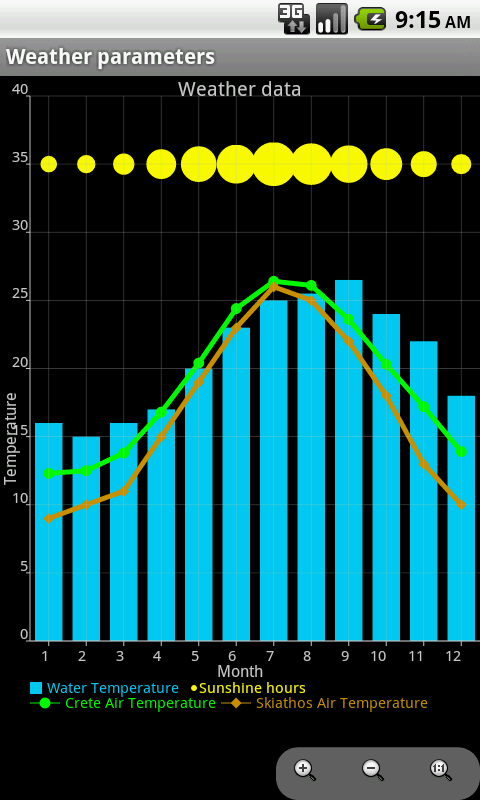
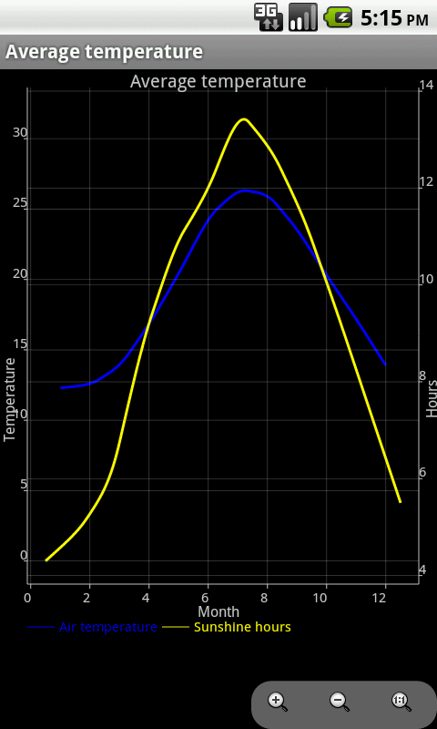

# AChartEngine

[AChartEngine](http://www.achartengine.org) is a charting library for Android applications.  
Forked from https://code.google.com/p/achartengine/

It currently supports the following chart types:

*  Line chart
*  Area chart
*  Scatter chart
*  Time chart
*  Bar chart
*  Pie chart
*  Bubble chart
*  Doughnut chart
*  Range (high-low) bar chart
*  Dial chart / gauge
*  Combined (any combination of line, cubic line, scatter, bar, range bar, bubble) chart
*  Cubic line chart

All the above supported chart types can contain multiple series, can be displayed with the X axis horizontally (default) or vertically and support many other custom features. The charts can be built as a view that can be added to a view group or as an intent, such as it can be used to start an activity.

The model and the graphing code is well optimized such as it can handle and display huge number of values.

* Find us [on Facebook](http://www.facebook.com/achartengine), too:
* Read a short introduction to AChartEngine [here](http://www.javaadvent.com/2012/12/achartengine-charting-library-for.html).
* Another good tutorial can be read [here](http://jaxenter.com/effort-free-graphs-on-android-with-achartengine-46199.html)

## Screenshots

## Community

* http://groups.google.com/group/achartengine

## License

* Code license: Apache License 2.0
